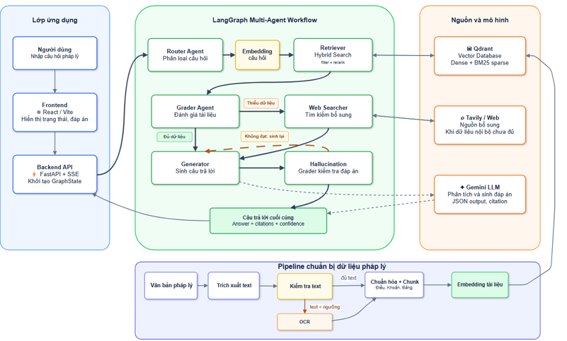

# Multi-Agent RAG for Vietnamese Legal QA

[](https://www.python.org/downloads/)
[](https://langchain-ai.github.io/langgraph/)
[](https://qdrant.tech/)
[](https://fastapi.tiangolo.com/)

Vietnamese legal question-answering system built with **LangGraph multi-agent RAG**, **Qdrant hybrid retrieval**, **FastAPI**, **React**, citation grounding, and hallucination checks.

## Features

- LangGraph workflow with Router, Retriever, Grader, Web Searcher, Generator, and Hallucination Grader nodes.
- Legal-aware ingestion with PDF/OCR extraction, article/clause/point metadata, and smart chunking for Vietnamese legal documents.
- Qdrant hybrid retrieval with dense vectors, BM25-style sparse vectors, metadata filters, reciprocal rank fusion, and optional reranking.
- Citation validation and deterministic hallucination checks before optional LLM review.
- FastAPI endpoints with synchronous and SSE streaming responses, plus a React/Vite frontend.

## Evaluation Snapshot

The evaluation files are lightweight and can be inspected without private API keys or a running Qdrant instance.

| Area | Metric | Current snapshot |
| --- | ---: | ---: |
| Corpus | Registry documents | 4 |
| Corpus | Chunks | 527 |
| Retrieval | Doc Hit@5 | 100.00% |
| Retrieval | Article Hit@5 | 93.75% |
| Retrieval | Clause Hit@5 | 84.38% |
| Retrieval | MRR | 90.63% |
| Generation | Evaluated cases | 5 |
| Generation | Fact Coverage | 70.00% |
| Citation | Display citation valid | 100.00% |

Regenerate the public report:

```bash
python scripts/evaluate_legal_qa.py
```

The generated Markdown report is saved to `eval_reports/latest.md`.

## Architecture



```text
User question
  -> Router Agent
  -> Retriever Agent: Qdrant hybrid retrieval + metadata filters
  -> Grader Agent: context relevance / completeness
  -> Web Searcher Agent: fallback when internal context is insufficient
  -> Generator Agent: grounded answer with citations
  -> Hallucination Grader: rule checks + optional LLM self-check
  -> Final answer + citations + traceable state
```

### Main Agents

- **Router**: classifies legal, non-legal, and conversational inputs.
- **Retriever**: combines semantic search, sparse keyword retrieval, metadata filters, and context expansion.
- **Grader**: checks whether retrieved context is enough for answer generation.
- **Web Searcher**: optional Tavily fallback when local legal data is insufficient.
- **Generator**: synthesizes a Vietnamese answer with source IDs and citations.
- **Hallucination Grader**: rejects missing citations, invalid source IDs, unsupported numbers, and malformed citation metadata before optional LLM review.

## Tech Stack

- **LLM orchestration**: LangGraph, LangChain, Gemini
- **Retrieval**: Qdrant, multilingual sentence embeddings, BM25-style sparse vectors
- **Backend**: FastAPI, Pydantic, SSE streaming
- **Frontend**: React, Vite, Tailwind CSS
- **Data processing**: PyMuPDF, pdfplumber, Tesseract OCR, custom legal chunking
- **Testing/evaluation**: pytest, offline JSONL benchmark, generated evaluation reports

## Repository Layout

```text
api/                         FastAPI app and QA router
data/evaluation/             Public benchmark seed for repeatable evaluation
data/processed/              Document registry and ingestion quality summary
eval_reports/                Baseline metrics and latest Markdown report
frontend/                    React/Vite UI
scripts/                     Indexing, evaluation, observability, and utility scripts
src/                         Agents, graph state, data pipeline, models, utilities
tests/                       Smoke tests for API contracts and deterministic checks
docker-compose.yml           Qdrant service definition
requirements.txt             Python dependencies
```

## Setup

### 1. Create Environment

```bash
python -m venv .venv
.venv\Scripts\activate
pip install -r requirements.txt
```

On Linux/macOS:

```bash
python -m venv .venv
source .venv/bin/activate
pip install -r requirements.txt
```

### 2. Configure Secrets

Copy `.env.example` to `.env` and set keys locally:

```bash
GEMINI_API_KEY=...
GEMINI_API_KEY_1=...
TAVILY_API_KEY=...
QDRANT_URL=http://localhost:6333
```

Security checklist:
- Keep `.env` local only.
- Confirm `.env` is ignored by git.
- Do not print raw API keys in logs.

### 3. Start Qdrant

```bash
docker-compose up -d qdrant
```

### 4. Build the Index

```bash
python scripts/build_index.py
```

### 5. Run the API

```bash
python api/main.py
```

API endpoints:

- `GET /`
- `POST /api/v1/qa/ask`
- `GET /api/v1/qa/stream?question=...`

### 6. Run the Frontend

```bash
cd frontend
npm install
npm run dev
```

## Evaluation

Generate the local evaluation report:

```bash
python scripts/evaluate_legal_qa.py
```

Score a real retrieval/generation run when predictions are available:

```bash
python scripts/evaluate_legal_qa.py --predictions eval_reports/my_run_predictions.jsonl
```

Expected prediction schema:

```json
{
  "id": "labor_working_time_001",
  "retrieved_documents": [
    {
      "content": "...",
      "metadata": {
        "doc_id": "45_2019_qh14",
        "article_number": 105,
        "clause_number": 1,
        "level": "clause"
      }
    }
  ],
  "answer": "... [S1]",
  "citations": [{"source": "[S1]", "url": "https://..."}],
  "retrieval_ms": 42,
  "answer_ms": 2500
}
```

## Tests

```bash
pytest -q
```

The smoke tests focus on deterministic contracts:
- FastAPI root response shape.
- Rule-based hallucination/citation checks.
- Retrieval filter parsing for article/clause queries.

## Key Rotation Observability

The LLM factory does not assign one fixed API key per agent. It hashes the agent purpose, selects a stable primary key index, and then tries the remaining keys as fallbacks. Logs show only key indices, never raw keys.

Check the routing plan without calling Gemini:

```bash
python scripts/check_key_rotation_observability.py
```

Example safe log shape:

```text
[LLM] agent=generator model=gemini-1.5-flash primary_key_index=2 fallback_key_indices=[3, 0, 1] json_mode=True
[LLM] agent=generator key_index=2 failed reason=quota/rate_limit
[LLM] agent=generator key_index=3 succeeded
```

## Limitations

- Retrieval metrics are from an offline evaluation snapshot.
- The public benchmark seed is in `data/evaluation/legal_qa_eval_30.jsonl`.
- Generation evaluation currently covers a small sample because it requires LLM calls.
- RAGAS and full graph evaluation are not part of the default local test suite.
